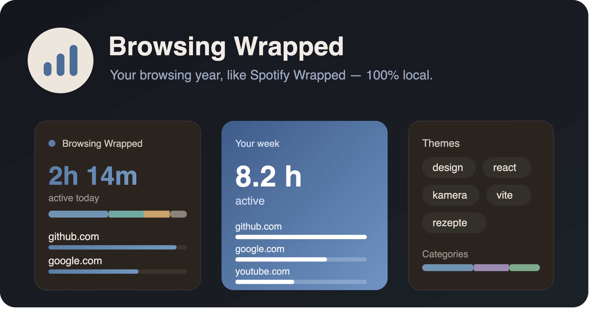

<div align="center">

# Browsing Wrapped

**Your year on the web — like Spotify Wrapped, but for your browsing. 100% local.**

A Safari extension that tracks your browsing and turns it into a beautiful,
animated recap. Top sites, time spent, recurring themes — all computed on your
device. Nothing ever leaves your Mac.

[](LICENSE) [](#requirements) [](#privacy) [](CONTRIBUTING.md)

</div>



---

## Table of Contents

- [Why](#why)
- [Privacy](#privacy)
- [Installation](#installation)
- [How it works](#how-it-works)
- [Development](#development)
- [Project structure](#project-structure)
- [Roadmap](#roadmap)
- [Contributing](#contributing)
- [License](#license)

## Why

Most "year in review" features ship your data to a server. Browsing Wrapped does
the opposite: it computes everything locally in the browser using IndexedDB, so
you get the fun recap **without** handing your history to anyone — including the
author. No account, no server, no sync, no telemetry.

## Privacy

- Only **domains** are stored — never full URLs.
- From searches, only **individual keywords** are stored — never the full query.
- Private windows and excluded domains are ignored.
- **No network requests carry your data.** The popup and the Wrapped story render
  entirely offline (domain tiles are generated locally, no favicon fetches).

## Installation

### Requirements

macOS with Safari and Homebrew to install.

### Homebrew

```bash
brew tap LaJuMiRa/safari-wrapped https://github.com/LaJuMiRa/safari-wrapped
brew install --cask browsing-wrapped
```

The first command registers this repository as a Homebrew tap (one-time, per machine);
the second downloads the latest release and installs **Browsing Wrapped.app** into
`/Applications`. For later updates just run `brew upgrade --cask browsing-wrapped`.

> **First launch:** the app is unsigned, so macOS blocks it once. Open
> **System Settings → Privacy & Security**, scroll down and click **“Open Anyway”**
> (on older macOS: right-click the app → **Open**). Then enable the extension under
> **Safari → Settings → Extensions → Browsing Wrapped** and allow website access on
> first use.

## How it works

The extension has three runtime pieces, all running locally:

1. **Background service worker** (`extension/background.js`) — listens to tab,
   navigation, focus and idle events; counts visits; runs the dwell-time clock;
   parses search-engine URLs into keywords; and writes everything to IndexedDB.
2. **Popup** (`src-popup/`) — the toolbar UI: period switcher, top sites,
   categories, settings. Built with React + Vite.
3. **Wrapped page** (`src-wrapped/`) — the full-screen animated story and the
   detail list pages, opened in their own tab.

Data lives in IndexedDB (version 2):

| Store        | Contents                                              |
| ------------ | ----------------------------------------------------- |
| `dailyStats` | Per-day, per-domain aggregates (visits, time) — kept  |
| `keywords`   | Per-day search-keyword frequencies — kept             |
| `events`     | Raw events, rolling window (retention configurable)   |

## Development

```bash
npm install
npm run build      # builds src-popup → extension/popup and src-wrapped → extension/wrapped
```

Package it into a Safari app (once per fresh clone):

```bash
xcrun safari-web-extension-converter ./extension \
  --app-name "Browsing Wrapped" \
  --bundle-identifier com.laurenz.browsingwrapped \
  --macos-only --no-open
```

Then in Xcode press **▶ Run**, and in Safari:

1. *Settings → Extensions* → enable **Browsing Wrapped**.
2. If it doesn't appear, enable **Develop → Allow Unsigned Extensions** (turn on the
   Develop menu via *Settings → Advanced → Show features for web developers*).
3. On first click, grant website access ("Allow on Every Website").

The converter references the files relatively (`../../extension/...`), so after
`npm run build` you only need **Product → Clean Build Folder** (⇧⌘K) → **Run**.

## Project structure

```
safari-wrapped/
├── extension/              # loadable web extension (input for Xcode)
│   ├── manifest.json       # MV3 manifest
│   ├── background.js       # service worker: tracking logic (self-contained)
│   ├── db.js               # IndexedDB layer (shared with popup & story)
│   ├── icons/              # app icons (16/48/128)
│   ├── popup/              # build output — do not edit by hand
│   └── wrapped/            # build output — story + detail pages
├── src-popup/              # React source for the popup
├── src-wrapped/            # React source for the Wrapped story & detail pages
├── vite.config.js          # popup build
├── vite.wrapped.config.js  # wrapped-page build
└── package.json            # `npm run build` builds both
```

## Roadmap

- [ ] Data export / import (JSON backup)
- [ ] More search engines and category rules
- [ ] Optional on-device theme clustering

## Contributing

Contributions are welcome — bug fixes, new categories or search engines,
translations, features. Please read [`CONTRIBUTING.md`](CONTRIBUTING.md) first.
The one hard rule: **no feature may let data leave the device.**

## License

[GNU GPL v3](LICENSE) © 2026 Laurenz Rauscher

This program is free software: you can redistribute it and/or modify it under
the terms of the **GNU General Public License v3.0**. It is distributed in the 
hope that it will be useful, but WITHOUT ANY WARRANTY.
See the [LICENSE](LICENSE) file for the full text.
